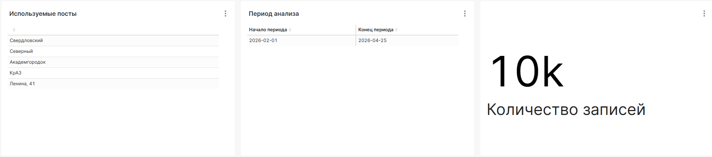

# Лабораторная работа №3: Сбор, предобработка и визуализация больших данных

**Студент:** Л. М. Соколов | КИ25-04-3М, 032540235  
**Преподаватель:** А. С. Кузнецов

---

## Содержание

- [1 Задачи](#1-задачи)
- [3 Ход работы](#3-ход-работы)
  - [3.1 Источник данных](#31-источник-данных)
  - [3.2 Этапы обработки](#32-этапы-обработки)
    - [3.2.1 Запуск инфраструктуры](#321-запуск-инфраструктуры)
    - [3.2.2 Загрузка исходных данных](#322-загрузка-исходных-данных)
    - [3.2.3 Очистка данных в Spark](#323-очистка-данных-в-spark)
    - [3.2.4 Загрузка данных в PostgreSQL](#324-загрузка-данных-в-postgresql)
    - [3.2.5 Формирование аналитических представлений](#325-формирование-аналитических-представлений)
  - [3.3 Визуализация данных](#33-визуализация-данных)
- [4 Вывод](#4-вывод)

## 1 Задачи

Для достижения цели необходимо на основе разработанной ранее "Белой книги" осуществить:

- очистку нетривиального "куска больших данных";
- визуализацию очищенных данных;
- развертывание экосистемы для обработки, хранения и отображения данных на базе Spark, PostgreSQL и Superset.

В качестве предметной области выбран мониторинг качества атмосферного воздуха в Красноярске. Основные анализируемые показатели: AQI, PM2.5, PM10, температура, влажность и давление.

## 3 Ход работы

### 3.1 Источник данных

В качестве источника данных был выбран сайт `https://air.krasn.ru`, содержащий данные о состоянии атмосферного воздуха в г. Красноярске. Данные собираются за задаваемый промежуток времени с выбранных постов мониторинга.

Для получения измерений используется REST API:

```text
https://air.krasn.ru/api/2.0/data
```

В запрос передаются начало и конец периода, интервал агрегации и список идентификаторов постов:

```text
time_begin=2026-04-01 00:00:00
time_end=2026-04-30 00:00:00
time_interval=hour
sites=3837,3857,3849,3479,3851
```

Дополнительно загружается справочник постов мониторинга. Он нужен для того, чтобы связать числовой идентификатор поста `site_id` с понятным названием, проектом и координатами.

В результате сбора формируются два набора данных:

| Набор данных | Содержание |
|---|---|
| `air_measurements.csv` | почасовые измерения качества воздуха по постам |
| `air_sites.csv` | справочник постов мониторинга |

### 3.2 Этапы обработки

#### 3.2.1 Запуск инфраструктуры

Для выполнения работы используется контейнерная инфраструктура Docker Compose. В состав стенда входят:

| Сервис | Назначение |
|---|---|
| PostgreSQL | хранение очищенных данных и аналитических представлений |
| Spark Master | запуск распределенной обработки данных |
| Spark Worker | выполнение задач Spark |
| Superset | построение графиков и дашборда |

Запуск инфраструктуры выполняется командой:

```bash
docker compose -f compose.yml up -d postgres spark-master spark-worker superset
```

Такой подход позволяет воспроизводимо запускать все компоненты, не устанавливая их напрямую в операционную систему.

#### 3.2.2 Загрузка исходных данных

Сбор данных выполняется скриптами:

```text
scripts/download/download_air.py
scripts/download/download_air_sites.py
```

Первый скрипт получает измерения качества воздуха. Для каждой записи сохраняются:

```text
site_id, time, aqi, iaqi, pm25, pm10, pm25_mcp, temperature, humidity, pressure
```

Второй скрипт получает справочную информацию о постах:

```text
site_id, site_name, project_id, project_name, latitude, longitude
```

Сырые данные сохраняются в каталогах:

```text
data/raw/air/air_measurements.csv
data/raw/air/air_measurements.json
data/reference/air_sites.csv
```

Raw-слой не изменяется вручную. Если правила очистки будут изменены, обработку можно повторить с исходных файлов.

#### 3.2.3 Очистка данных в Spark

Очистка выполняется скриптом:

```text
scripts/clean/clean_air_data.py
```

Spark читает сырой CSV-файл, приводит поля к нужным типам и формирует очищенный набор данных. На этом этапе выполняются следующие операции:

- поле `time` преобразуется в `timestamp`;
- числовые поля приводятся к типу `double`;
- удаляются записи без `site_id` и без времени измерения;
- удаляются дубликаты по паре `site_id` и `timestamp`;
- значения вне допустимых физических границ заменяются на пустые значения;
- добавляются календарные признаки `date`, `hour`, `month`;
- добавляется признак пика загрязнения `is_pollution_peak`;
- добавляется признак наличия пропусков `has_missing_pollution_value`.

Для контроля качества применяются диапазоны допустимых значений:

| Поле | Допустимый диапазон |
|---|---|
| `aqi` | 0-1000 |
| `pm25` | 0-2000 |
| `pm10` | 0-3000 |
| `temperature` | -60-60 |
| `humidity` | 0-100 |
| `pressure` | 650-820 |

Очищенный файл сохраняется в staging-слой:

```text
data/staging/air_cleaned.csv
```

#### 3.2.4 Загрузка данных в PostgreSQL

Загрузка очищенных данных в PostgreSQL выполняется скриптом:

```text
scripts/load/load_cleaned_to_postgres.py
```

В базу данных загружаются две основные таблицы:

| Таблица | Назначение |
|---|---|
| `air_cleaned` | очищенные почасовые измерения качества воздуха |
| `air_sites` | справочник постов мониторинга |

Таблица `air_cleaned` содержит факты измерений:

```text
site_id, timestamp, date, hour, month, aqi, iaqi, pm25, pm10,
pm25_mcp, temperature, humidity, pressure,
is_pollution_peak, has_missing_pollution_value
```

Таблица `air_sites` содержит справочную информацию:

```text
site_id, site_name, project_id, project_name,
project_short_name, latitude, longitude
```

Такая структура разделяет фактические измерения и справочник постов. Это упрощает последующую агрегацию и позволяет отображать в отчетах не только числовые идентификаторы, но и понятные названия постов.

#### 3.2.5 Формирование аналитических представлений

Для визуализации в Superset созданы SQL-представления. Они рассчитывают агрегаты поверх `air_cleaned` и `air_sites`.

Используются следующие представления:

| Представление | Назначение |
|---|---|
| `v_air_daily_by_site` | дневные агрегаты по каждому посту |
| `v_air_hourly_profile` | средний почасовой профиль по каждому посту |
| `v_air_site_summary` | сводка по постам за весь период |

Представление `v_air_daily_by_site` содержит одну строку на пост и дату. Оно используется для анализа динамики загрязнения по дням. В нем рассчитываются средние и максимальные значения AQI, PM2.5, PM10, температуры, влажности и давления.

Представление `v_air_hourly_profile` содержит одну строку на пост и час суток. Оно позволяет определить, в какие часы средние значения загрязнения выше.

Представление `v_air_site_summary` содержит одну строку на пост за весь период. Оно используется для рейтинга постов, общей сводки и контроля объема собранных данных.

### 3.3 Визуализация данных

Для визуализации используется Apache Superset. На основе представлений PostgreSQL в Superset создаются датасеты, на основе которых, в свою очередь строятся чарты. 
Ниже, на рисунках представлены созданные чарты.




## 4 Вывод

В ходе работы был реализован полный цикл обработки данных мониторинга качества воздуха: 
сбор данных из открытого API, сохранение сырого слоя, очистка в Apache Spark, загрузка очищенных данных в PostgreSQL и построение визуализаций в Apache Superset.

Полученный набор данных содержит почасовые измерения по пяти постам мониторинга за выбранный период. Для анализа были сформированы представления, позволяющие изучать дневную динамику AQI, сравнивать посты между собой и анализировать суточный профиль концентрации PM2.5.

В результате был создан аналитический дашборд, который отображает период и объем собранных данных, динамику загрязнения, рейтинг постов и почасовые закономерности. Такой подход позволяет перейти от сырых измерений к понятному аналитическому представлению данных о качестве воздуха.
