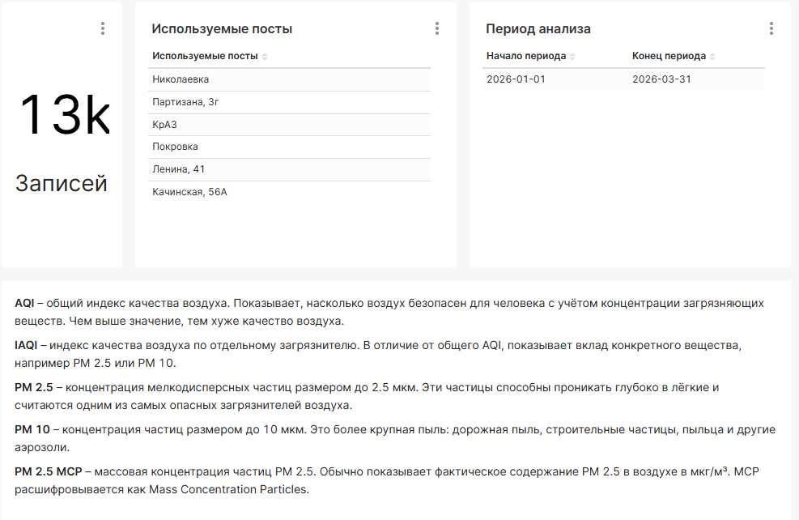
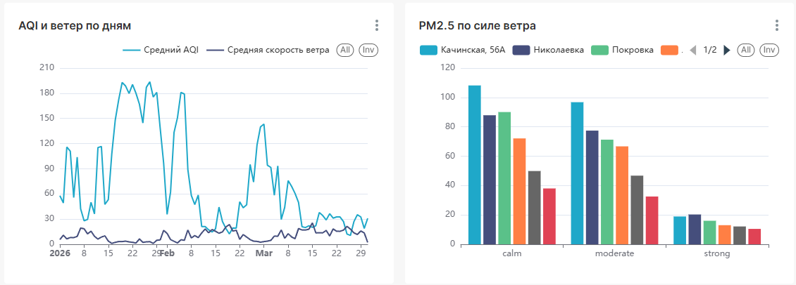
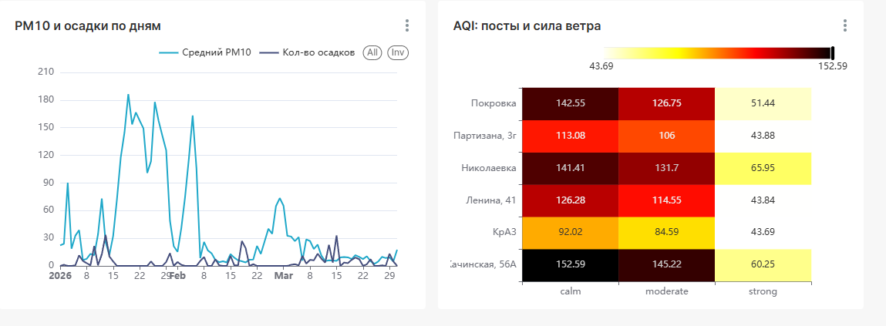

# Лабораторная работа №4: Apache Hadoop. Парадигма MapReduce. Apache Spark

**Студент:** Л. М. Соколов | КИ25-04-3М, 032540235  
**Преподаватель:** А. С. Кузнецов

---

# 1 Цель

Цель работы, разработать Spark-приложение для импорта, экспорта и аналитической обработки данных.
В качестве предметной области используется анализ качества воздуха в Красноярске с учетом погодных факторов.

# 2 Ход работы

## 2.1 Источники данных

В работе используются несколько источников, отличающихся структурой и назначением:

- `air.krasn.ru API`, данные мониторинга атмосферного воздуха по постам Красноярска;
- `air.krasn.ru API`, справочник постов наблюдения с координатами и названиями площадок;
- `Open-Meteo Historical Weather API`, исторические погодные данные по координатам Красноярска.

Был добавлен источник данных, содержащий информацию о погодных данных.
Также ввиду ограничений на кол-во единовременно извлекаемых записей было
добавлено разделение загружаемых данных на батчи ограниченного размера.
## 2.1 Spark-приложения

Были созданы следующие Spark задачи:

`clean_air_data.py` очищает данные мониторинга воздуха:

- приводит временные метки к типу `timestamp`;
- приводит числовые поля к корректным типам;
- отбрасывает невозможные значения по AQI, PM2.5, PM10, температуре, влажности и давлению;
- удаляет дубли по паре `site_id` и `timestamp`;
- добавляет календарные признаки и флаги качества данных;
- сохраняет результат.

`clean_weather_data.py` очищает погодные данные:

- нормализует почасовые измерения Open-Meteo;
- приводит погодные показатели к числовым типам;
- проверяет допустимые диапазоны значений;
- добавляет признаки `wind_speed_group` и `has_precipitation`;
- сохраняет результат.

`build_data_marts.py` строит аналитические витрины:

- читает только staging-таблицы `air_cleaned` и `weather_cleaned`;
- объединяет данные воздуха и погоды по часу;
- рассчитывает агрегаты по дням, постам мониторинга и группам скорости ветра;
- сохраняет результаты.

## 2.3 Витрины данных

В результате выполнения пайплайна формируются следующие таблицы:

| Таблица | Назначение |
|---|---|
| `air_cleaned` | очищенные почасовые измерения загрязнения воздуха |
| `weather_cleaned` | очищенные почасовые погодные измерения |
| `air_sites` | справочник постов мониторинга |
| `mart_air_weather_hourly` | объединенная почасовая таблица воздуха и погоды |
| `mart_air_weather_daily` | дневная витрина по постам мониторинга |
| `mart_pollution_by_wind` | сравнение загрязнения при разных группах скорости ветра |
| `mart_data_quality_summary` | сводка по качеству и полноте данных |

Таблицы с префиксом `mart` представляют собой витрины данных и будут использоваться в качестве датасетов Superset.

Также производится дополнительная агрегация во view для подстановки имен постов.
## 2.4 Пайплайнн

Шаги пайплайна:

1. запуск PostgreSQL, Spark и Superset;
2. загрузка raw-данных воздуха, справочника постов и погоды;
3. нормализация всех источников в `data/staging`;
4. построение витрин из staging-таблиц в `data/marts`;
5. загрузка staging-таблиц, справочников и витрин в PostgreSQL.

## 3 Визуализация

Для визуализации так же используется Superset. Ниже, на рисунках представлено содержимое дэшборда.

## 4 Вывод

В ходе работы пайплайн из ЛР3 был расширен до Spark-приложения для анализа нескольких источников данных. 
