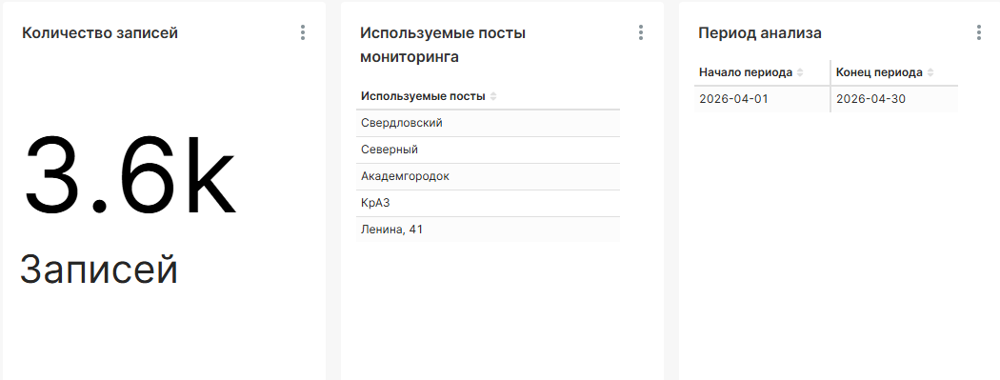
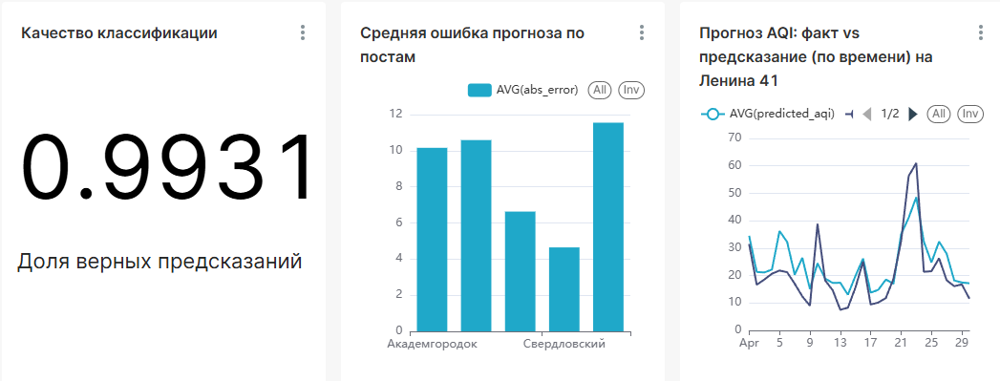
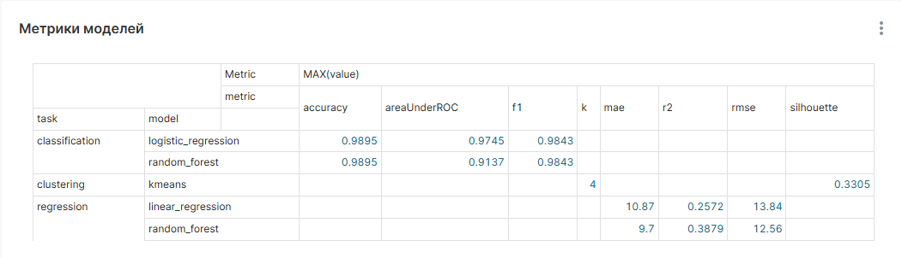
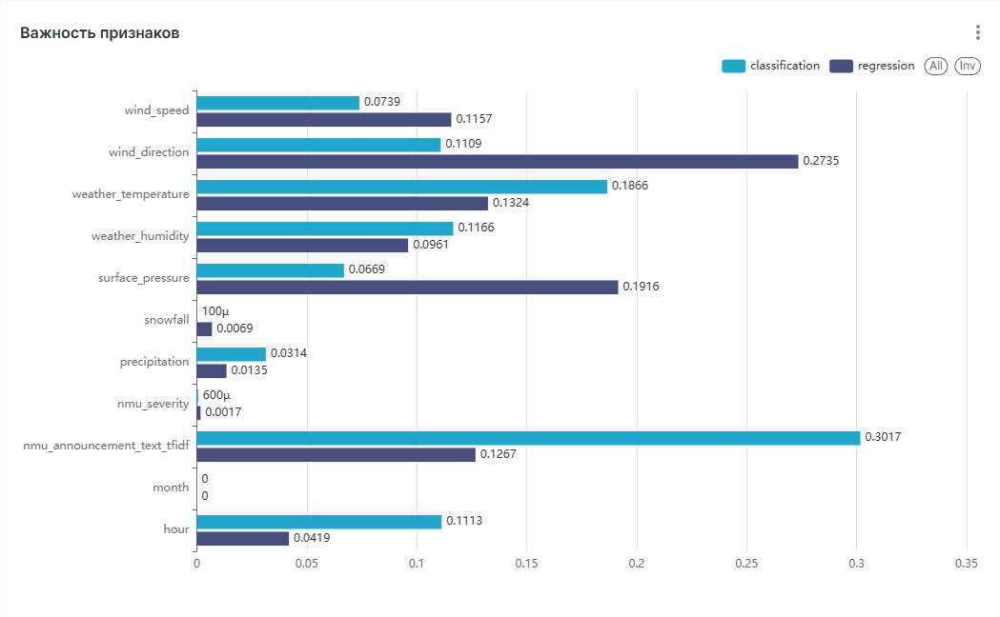
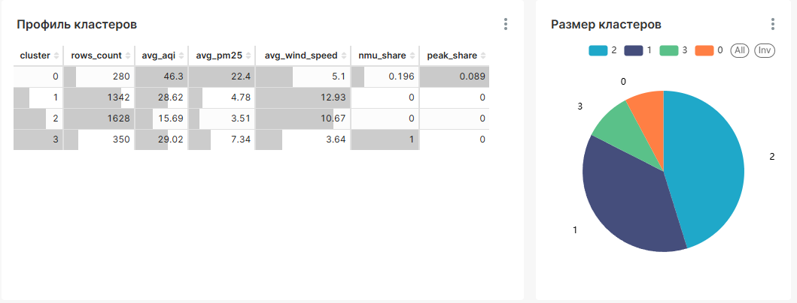
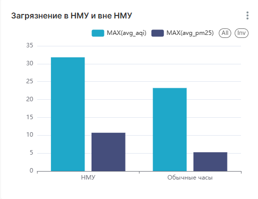

# Лабораторная работа №5: Spark MLlib и Spark ML.
**Студент:** Л. М. Соколов | КИ25-04-3М, 032540235  
**Преподаватель:** А. С. Кузнецов

---

## Содержание

- [1 Цель](#1-цель)
- [2 Ход работы](#2-ход-работы)
  - [2.1 Источники данных](#21-источники-данных)
  - [2.2 Формирование признакового пространства](#22-формирование-признакового-пространства)
  - [2.3 Spark ML-приложение](#23-spark-ml-приложение)
    - [2.3.1 Регрессия: прогноз AQI](#231-регрессия-прогноз-aqi)
    - [2.3.2 Классификация: пик загрязнения](#232-классификация-пик-загрязнения)
    - [2.3.3 Кластеризация условий](#233-кластеризация-условий)
  - [2.4 Результаты моделей](#24-результаты-моделей)
  - [2.5 Конвейер](#25-конвейер)
- [3 Визуализация](#3-визуализация)
- [4 Сравнительный анализ ЛР 4 и ЛР 5](#4-сравнительный-анализ-лр-4-и-лр-5)
- [5 Вывод](#5-вывод)

## 1 Цель

Цель работы – дополнить созданное при выполнении [ЛР 4](../Laba4/Laba4.md) Spark-приложение
алгоритмами машинного обучения и методами из _Spark MLlib / Spark ML_ для анализа нетривиального «куска больших данных». Обязательное условие – использование различных (структурированных и неструктурированных) источников данных. Дополнительно требуется провести сравнительный анализ результатов ЛР 4 и ЛР 5.

## 2 Ход работы

### 2.1 Источники данных

В работе объединяются источники разной природы:

| Источник | Природа | Содержание |
|---|---|---|
| `air.krasn.ru` API | структурированный | почасовые измерения качества воздуха (AQI, PM2.5, PM10) по постам |
| `air.krasn.ru` API | структурированный (справочник) | названия и координаты постов мониторинга |
| Open-Meteo Historical Weather API | структурированный | почасовые погодные данные по координатам Красноярска |
| Оповещения о НМУ с сайта администрации Красноярска | **неструктурированный** | текстовые предупреждения о неблагоприятных метеорологических условиях |

Структурированные источники (воздух + погода) были подготовлены ещё в ЛР 4. В ЛР 5 добавлен
**неструктурированный источник** – текстовые оповещения о НМУ
(`admkrsk.ru/citytoday/ecology/Pages/NMU.aspx`).

Сбор НМУ выполняется скриптом `scripts/download/download_nmu.py`. Скрипт загружает HTML-страницу,
очищает её от разметки и регулярными выражениями извлекает объявления вида
«_Общий прогноз: НМУ ожидаются с 19 часов 25 апреля 2026 года до 10 часов 26 апреля 2026 года_» и «_Первый режим с 15 часов 16 января 2026 года …_». Из каждого объявления извлекаются дата публикации, режим (общий прогноз / первый / второй / третий), начало и конец периода, а также исходный текст объявления.

Очистка НМУ (`scripts/clean/clean_nmu_data.py`, Spark) разворачивает каждый период НМУ до почасовой сетки: для каждого часа периода формируется строка с признаком `is_nmu`, уровнем режима `regime_level` и текстом объявления. Это позволяет соединить НМУ с почасовыми измерениями воздуха и погоды по `timestamp`.

### 2.2 Формирование признакового пространства

Spark-приложение `scripts/ml/train_models.py` строит единую признаковую таблицу, соединяя по `timestamp`:

- воздух (`air_cleaned`): `aqi`, `pm25`, `pm10`, `is_pollution_peak`, календарные признаки;
- погоду (`weather_cleaned`): температура, влажность, осадки, снег, давление, скорость и направление ветра;
- НМУ (`nmu_hourly`): `is_nmu`, ординальный признак эскалации `nmu_severity`
  (0 – нет НМУ, 1 – общий прогноз, 2…4 – объявленные режимы) и текст объявления.

Текст объявления (неструктурированные данные) преобразуется в числовые признаки конвейером `Tokenizer → HashingTF → IDF` (TF-IDF, 64 измерения) и добавляется к числовым признакам через `VectorAssembler`. Пропуски в числовых признаках заполняются средними (`Imputer`). Таким образом в одной модели одновременно работают структурированные (воздух, погода) и неструктурированные (текст НМУ) источники.

### 2.3 Spark ML-приложение

Реализованы три семейства задач Spark ML. Для каждой используется `Pipeline`, разбиение
выборки на обучающую и тестовую и штатные оценщики (`Evaluator`).

#### 2.3.1 Регрессия: прогноз AQI

Цель – предсказать индекс качества воздуха `aqi` по погодным, временным и НМУ-признакам (включая TF-IDF текста). Обучаются и сравниваются `LinearRegression` и `RandomForestRegressor`. Метрики – RMSE, MAE, R² (`RegressionEvaluator`). Предсказания и важность признаков сохраняются по модели случайного леса.

#### 2.3.2 Классификация: пик загрязнения

Цель – предсказать бинарный признак пика загрязнения `is_pollution_peak`. Обучаются
`LogisticRegression` и `RandomForestClassifier`. Метрики – ROC AUC (`BinaryClassificationEvaluator`), accuracy и F1 (`MulticlassClassificationEvaluator`). Для каждой записи сохраняется вероятность пика.

#### 2.3.3 Кластеризация условий

Цель – выделить типовые «режимы» совокупности воздух+погода без разметки. Признаки стандартизуются (`StandardScaler`) и подаются в `KMeans` (k = 4 по умолчанию). Качество разбиения оценивается коэффициентом силуэта (`ClusteringEvaluator`). Для каждого кластера строится профиль (средние значения показателей, доля часов НМУ и доля пиков).

### 2.4 Результаты моделей

Признаковая таблица – 3600 строк (5 постов × 720 часов за апрель 2026). Метрики рассчитаны на отложенной тестовой выборке (20 %).

| Задача | Модель | Метрики |
|---|---|---|
| Регрессия (AQI) | LinearRegression | RMSE 13.84, MAE 10.87, R² 0.257 |
| Регрессия (AQI) | RandomForestRegressor | **RMSE 12.56, MAE 9.70, R² 0.388** |
| Классификация (пик) | LogisticRegression | **ROC AUC 0.975**, accuracy 0.990, F1 0.984 |
| Классификация (пик) | RandomForestClassifier | ROC AUC 0.914, accuracy 0.990, F1 0.984 |
| Кластеризация | KMeans (k = 4) | silhouette 0.330 |

Случайный лес заметно превосходит линейную регрессию по прогнозу AQI (R² 0.39 против 0.26), что указывает на нелинейные связи загрязнения с погодой. В задаче классификации пиков обе модели дают высокое качество (AUC 0.91–0.98).

**Важность признаков.** Для классификации пика загрязнения наибольший вклад вносит именно TF-IDF текста оповещений о НМУ (важность 0.30), опережая температуру (0.19) и влажность (0.12). То есть добавленный неструктурированный источник оказался самым информативным признаком. В регрессии AQI лидируют направление ветра (0.27), приземное давление (0.19) и температура (0.13), текст НМУ – на четвёртом месте (0.13).

**Профиль кластеров (KMeans).** Выделяются интерпретируемые режимы:

| Кластер | Часов | Сред. AQI | Сред. ветер | Доля НМУ | Доля пиков | Интерпретация |
|---|---|---|---|---|---|---|
| 0 | 280 | 46.3 | 5.1 | 0.20 | 0.089 | загрязнённый штиль (высокий AQI, слабый ветер) |
| 1 | 1342 | 28.6 | 12.9 | 0.00 | 0.00 | ветрено, умеренно чисто |
| 2 | 1628 | 15.7 | 10.7 | 0.00 | 0.00 | чистый воздух, сильный ветер |
| 3 | 350 | 29.0 | 3.6 | 1.00 | 0.00 | часы объявленных НМУ |

### 2.5 Конвейер

Конвейер ЛР 4 расширен двумя шагами (НМУ и ML) и теперь состоит из шести стадий
(`pipeline.py`):

1. запуск инфраструктуры (PostgreSQL, Spark, Superset);
2. загрузка raw-данных воздуха, справочника постов, погоды **и оповещений о НМУ**;
3. нормализация всех источников в `data/staging` (включая разворачивание НМУ в почасовую сетку);
4. построение витрин воздуха и погоды из staging;
5. **обучение Spark ML-моделей** и выгрузка предсказаний, метрик, важности признаков и кластеров;
6. загрузка staging-таблиц, витрин и результатов ML в PostgreSQL с созданием представлений.

## 3 Визуализация

Для визуализации используется Apache Superset поверх представлений PostgreSQL. 

## 4 Сравнительный анализ ЛР 4 и ЛР 5

| Критерий        | ЛР 4                                             | ЛР 5                                                          |
| --------------- | ------------------------------------------------ | ------------------------------------------------------------- |
| Тип аналитики   | описательная                                     | предиктивная                                                  |
| Источники       | воздух + погода (структурированные)              | + неструктурированный текст НМУ (TF-IDF)                      |
| Обработка Spark | `clean_*`, `build_data_marts`                    | + `clean_nmu_data`, `train_models` (Spark ML)                 |
| Выходные данные | витрины `mart_*`                                 | предсказания, метрики качества, важность признаков, кластеры  |
| Ответ на вопрос | «что наблюдалось» (средние, максимумы, рейтинги) | «что будет / почему» (прогноз AQI, риск пика, типовые режимы) |

ЛР 4 отвечала на вопрос «что наблюдалось»: рассчитывались средние и максимальные значения, рейтинги постов, агрегаты по дням и группам ветра. ЛР 5 переходит к вопросам «что будет» и «от чего зависит»: модели прогнозируют AQI и риск пика загрязнения, оценивают вклад каждого фактора (в том числе текстового сигнала НМУ), а кластеризация выделяет типовые сочетания «воздух + погода».
Добавление неструктурированного источника (НМУ) позволило связать административные оповещения с фактическими измерениями и проверить, действительно ли в периоды НМУ загрязнение выше (представление `v_pollution_by_nmu`):

| Период | Часов | Сред. AQI | Сред. PM2.5 | Доля пиков |
|---|---|---|---|---|
| Часы НМУ | 405 | 31.8 | 10.7 | 0.040 |
| Обычные часы | 3195 | 23.2 | 5.3 | 0.003 |

В часы объявленных НМУ средний AQI выше (31.8 против 23.2), концентрация PM2.5 вдвое больше, а пики загрязнения встречаются более чем в 10 раз чаще. Это согласуется с тем, что TF-IDF-признак текста НМУ оказался наиболее важным предиктором пика загрязнения.

## 5 Вывод

В ходе работы Spark-приложение из ЛР 4 было дополнено компонентом машинного обучения на базе
Spark ML. Реализованы и оценены три типа моделей: регрессия прогноза AQI, классификация пиков загрязнения и кластеризация условий. 
