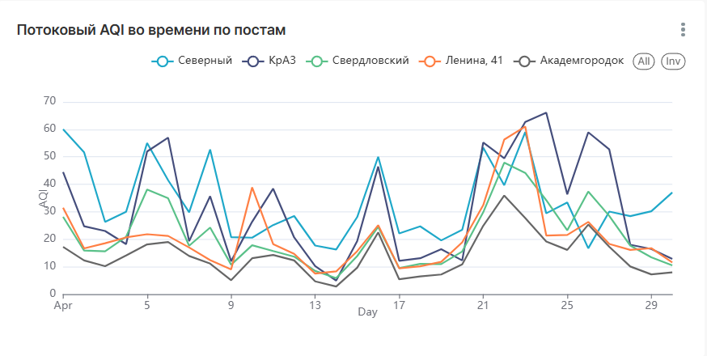
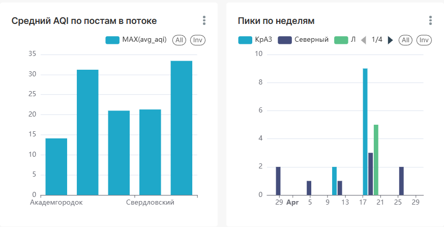

# Лабораторная работа №6: Потоковая обработка больших данных (Apache Kafka) и бизнес-план BD-инфраструктуры.
**Студент:** Л. М. Соколов | КИ25-04-3М, 032540235  
**Преподаватель:** А. С. Кузнецов

---

## Содержание

- [1 Цель](#1-цель)
- [2 Ход работы (Часть 1 – приложение на Apache Kafka)](#2-ход-работы-часть-1--приложение-на-apache-kafka)
  - [2.1 Стартовая точка](#21-стартовая-точка)
  - [2.2 Брокер Kafka в инфраструктуре](#22-брокер-kafka-в-инфраструктуре)
  - [2.3 Producer: имитация потока](#23-producer-имитация-потока)
  - [2.4 Consumer: Spark Structured Streaming](#24-consumer-spark-structured-streaming)
    - [2.4.1 Преобразование](#241-преобразование)
    - [2.4.2 Фильтрация](#242-фильтрация)
    - [2.4.3 Агрегирование](#243-агрегирование)
  - [2.5 Приёмники результатов](#25-приёмники-результатов)
  - [2.6 Интеграция в конвейер](#26-интеграция-в-конвейер)
  - [2.7 Кросс-платформенность, сборка и запуск](#27-кросс-платформенность-сборка-и-запуск)
  - [2.8 Результаты](#28-результаты)
- [3 Визуализация](#3-визуализация)
- [4 Часть 2. Бизнес-план BD-инфраструктуры](#4-часть-2-бизнес-план-bd-инфраструктуры)
- [5 Вывод](#5-вывод)

## 1 Цель

Цель работы – познакомиться с API обработки потоковых больших данных и реализовать приложение на **Apache Kafka**, выполняющее преобразование, фильтрацию и агрегирование данных, модернизировав результаты [ЛР 5](../Laba5/Laba5.md). Дополнительно требуется обеспечить кросс- платформенность и подготовить **бизнес-план** создания инфраструктуры больших данных на предприятии.

## 2 Ход работы (Часть 1 – приложение на Apache Kafka)

### 2.1 Стартовая точка

За основу взято Spark-приложение из ЛР 5. Пайплайн ЛР 5 сохранён; поверх него добавлен потоковый контур на Kafka.

### 2.2 Брокер Kafka в инфраструктуре

Добавлен контейнера брокера **Apache Kafka 3.9** в режиме **KRaft** (без ZooKeeper). Настроены два листенера:

- `INTERNAL` (`kafka:9092`) – для контейнеров compose-сети (к нему подключается Spark);
- `EXTERNAL` (`localhost:9092`) – для процессов на хосте (к нему подключается producer).

Одноразовый сервис `kafka-init` создаёт топики `air-events` (входной поток событий) и
`air-aggregates` (выходные агрегаты). Spark 4.1.1 (Scala 2.13) читает Kafka, а для записи агрегатов в PostgreSQL в образ Spark добавлен JDBC-драйвер `postgresql`.

### 2.3 Producer: имитация потока

Скрипт `scripts/stream/producer.py`имитирует поток с постов мониторинга: читает исторический сырой CSV (`data/raw/air/air_measurements.csv`), подмешивает название поста из справочника `data/reference/air_sites.csv` и отправляет каждую запись отдельным **JSON-событием** в топик `air-events` (ключ – `site_id`) с регулируемой задержкой (`--rate`). Числовые поля передаются строками – приведение типов выполняет потоковый consumer. Скрипт кросс-платформенный (только stdlib + `kafka-python`).

### 2.4 Consumer: Spark Structured Streaming

Скрипт `scripts/stream/stream_processing.py` читает поток из Kafka
(`readStream.format("kafka")`, топик `air-events`) и выполняет **три обязательные операции**
потоковой обработки.

#### 2.4.1 Преобразование

Бинарное поле `value` разбирается `from_json` по заданной схеме, строковые поля приводятся к числам, время измерения парсится `to_timestamp`, и вычисляется производный признак `is_pollution_peak` (AQI > 100, либо PM2.5 > 35, либо PM10 > 150).

#### 2.4.2 Фильтрация

Из потока отбрасывается «мусор»: события без времени измерения или без поста, а также записи с индексом AQI вне валидного диапазона `[0, 1000]`.

#### 2.4.3 Агрегирование

По событийному времени строятся **оконные агрегаты**: `window(event_time, "1 hour")` с watermark `2 hours`, группировка по посту. Для каждого окна и поста считаются средний и максимальный AQI, средний PM2.5, число часов-пиков (`peak_count`) и число замеров (`sample_count`).

### 2.5 Приёмники результатов

Один запрос через `foreachBatch` (`outputMode("complete")`) пишет снимок агрегатов сразу в **три приёмника**:
- **console** – печать оконных агрегатов на каждый микробатч;
- **PostgreSQL** – таблица `mart_stream_aggregates`;
- **Kafka** – выходной топик `air-aggregates` (агрегаты в JSON).

Над таблицей создаются представления `v_stream_aggregates` и `v_stream_site_summary`
(сводка по постам) – на них строятся дашборды.

### 2.6 Интеграция в конвейер

Конвейер `pipeline.py` расширен до **7 стадий**: после стадий ЛР 5 (инфраструктура → загрузка → очистка → витрины → ML → загрузка в PostgreSQL) добавлена **стадия 7 – потоковая обработка**. Она выполняет: сброс состояния (очистка checkpoint и пересоздание топиков) → запуск producer → запуск Spark-consumer в режиме `--available-now` (обработать всё доступное и завершиться) → создание представлений `v_stream_*`. 

### 2.7 Кросс-платформенность, сборка и запуск

Вся инфраструктура развёртывается одинаково на Windows/Linux/macOS через Docker. Сборка и запуск:

```bash
docker compose -f compose.yml up -d
python pipeline.py
python pipeline.py --from-step 7            # только потоковый контур
```
### 2.8 Результаты

При прогоне стадии 7 пайплайна producer передаёт в топик все исторические события, а Spark-consumer агрегирует их по часовым окнам. В таблицу `mart_stream_aggregates` записывается **3600 строк** (5 постов × 720 часовых окон за апрель 2026). Сводка по постам (`v_stream_site_summary`):

| Пост | Окон | Замеров | Сред. AQI | Макс. AQI | Сред. PM2.5 | Часов-пиков |
|---|---|---|---|---|---|---|
| Северный | 720 | 720 | 33.4 | 73 | 8.0 | 9 |
| КрАЗ | 720 | 720 | 31.2 | 70 | 8.0 | 11 |
| Свердловский | 720 | 720 | 21.3 | 52 | 5.1 | 0 |
| Ленина, 41 | 720 | 720 | 21.0 | 66 | 5.1 | 5 |
| Академгородок | 720 | 720 | 14.1 | 40 | 3.4 | 0 |

Поток корректно воспроизводит структуру данных: наибольший средний AQI и число часов-пиков – на постах «Северный» и «КрАЗ», наименее загрязнён «Академгородок».

## 3 Визуализация

Для визуализации используется Apache Superset поверх представлений PostgreSQL. Поверх supserset из ЛР 5 был собран отдельный потоковый дашборд по представлениям: потоковый AQI во времени по постам, средний AQI по постам и пики загрязнения по неделям. 





## 4 Часть 2. Бизнес-план BD-инфраструктуры

Во второй части подготовлен бизнес-план создания инфраструктуры больших данных на реальном предприятии – **Красноярском алюминиевом заводе (КрАЗ, АО «РУСАЛ Красноярск»)**, который входит в наши данные как пост мониторинга «КрАЗ» и является одним из основных источников выбросов города.

>Полный документ: **[business-plan.md](business-plan.md)**.

## 5 Вывод

В ходе работы Spark-приложение из ЛР 5 было дополнено потоковым контуром на базе Apache Kafka и Spark Structured Streaming. Реализованы producer (имитация потока событий с постов мониторинга) и consumer, выполняющий три операции потоковой обработки – преобразование, фильтрацию и оконное агрегирование, – с записью результатов в PostgreSQL и выходной топик Kafka. Потоковый контур интегрирован в общий конвейер отдельной стадией, обеспечена кросс-платформенность за счёт Docker. Во второй части подготовлен бизнес-план создания платформы больших данных для КрАЗа.
